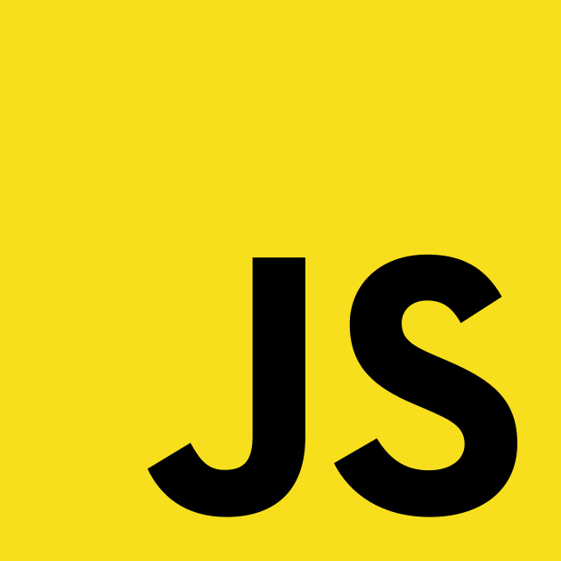
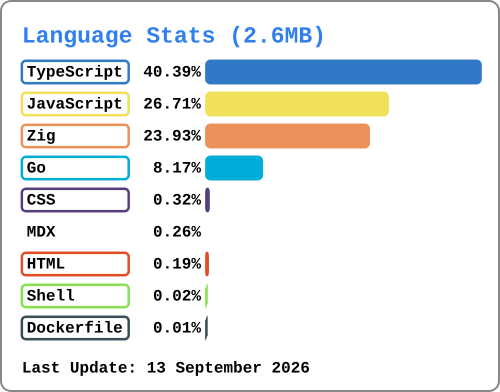

<h1>
  

    Welcome
  

</h1>

  <picture style="width: 75%;">
    <source media="(prefers-color-scheme: dark)" srcset="assets/signature-white.png">
    <source media="(prefers-color-scheme: light)" srcset="assets/signature-black.png">
  </picture>

<h2>
  Skill
</h2>

  

    
    
    
    
  

 

  

<h2>
  Platform
</h2>

<ul>
  <li>
    <a href="https://gitlab.com/youdie323323" target="_blank">
      GitLab
    </a>
  </li>
</ul>
