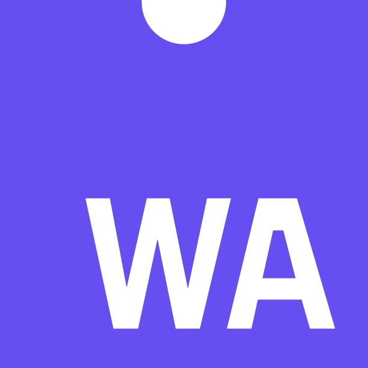

<h1>
  

    Welcome
  

</h1>

<h2>
  

    Interest
  

</h2>

<ul>
  <li>
    Obfuscation
  </li>
  <li>
    $\Large \textit{Mathematic}$
  </li>
  <li>
    Software design
  </li>
</ul>

<h2>
  Skill
</h2>

  

    
    
    
    
    
  

  

    
  

  

<h2>
  Platform
</h2>

<ul>
  <li>
    <a href="https://gitlab.com/youdie323323" target="_blank">
      GitLab
    </a>
  </li>
</ul>
